# Beacon Books

# Giới thiệu phần mềm
Beacon Books là một phần mềm quản lý thư viện đa dụng, thân thiện với người dùng. Phần mềm được thiết kế để hỗ trợ việc tổ chức, quản lý và vận hành các thư viện; hơn thế nữa, Beacon Books cũng giúp đỡ người dùng mượn, trả sách dễ dàng và nhanh chóng hơn.
- [0. Sign in/Sign up](#0-sign-in-sign-up)
- [1. Giao diện admin](#1-giao-diện-admin)
- [2. Giao diện reader](#2-giao-diện-reader)
- [Về đồ họa của game:](#về-đồ-họa-của-game)
- [Về source code game](#về-source-code-game)

# 0. Sign in/ Sign up

## a. Sign in

- Nếu bạn đã có tài khoản, hãy nhập username và password sau đó nhấn "Sign in"
- Nếu username và password đúng, bạn sẽ đăng nhập được vào Beacon Books.
- Nếu username và password chưa chính xác, hệ thống sẽ thông báo và bạn vui lòng kiểm tra lại username và password rồi tiến hành đăng nhập lại.
  

## b.Sign up
- Nếu bạn chưa có tài khoản, chọn "Sign up" để tạo tài khoản mới.
  
- Nhập name, username và password bạn muốn.
- Nếu password bạn nhập có ít hơn 8 kí tự, hệ thống sẽ báo lỗi, bạn phải nhập lại 1 password có đủ 8 kí tự.
  
- Nếu username bạn nhập đã được sử dụng, hệ thống cũng sẽ báo lỗi, bạn phải nhập lại 1 username khác.

- Sau khi Sign up thành công, hệ thống sẽ đưa bạn quay lại giao diện ban đầu để Sign in.

# 1. Giao diện admin
## a. Search

- Có 3 tiêu chí để Search: Title, Authors, PublishYear.
- Bạn có thể chọn Search theo 1, 2 hoặc cả 3 tiêu chí.
## b. DASHBOARD
## c. RESOURCE

- Filter: Bạn có thể lọc tài liệu thông qua filter: Book / Thesis
  
- Xem Description bằng cách bấm vào bìa sách
  
- Bấm vào tên cuốn sách để xem các thông tin chi tiết
  
- Ngoài ra, bạn còn có thể sửa và xóa tài liệu nếu muốn
  
- Bạn còn có thể đọc comment, đánh giá của mọi người về tài liệu đó và tự viết comment, đáng giá của chính mình.
  

## d. ADD DOCUMENT

## e. MANAGE USER

- Filter: Bạn có thể lọc người dùng thông qua filter: Admin / Reader.
  
- Add user: Bạn có thể thêm user bằng tài khoản admin (tài khoản admin chỉ có thể được tạo từ 1 tài khoản admin khác).
  
- Xem thông tin của các user đã có: Admin có quyền xem thông tin về các user khác khi bấm vào tài khoản của họ trong danh sách user.
  
# 2. Giao diện reader

Có tổng cộng 12 level với mức độ khó dễ khác nhau để bạn chơi. Khi di chuột lên 1 level, level đó sẽ phát sáng. Chỉ cần
click chuột để chơi level đó.

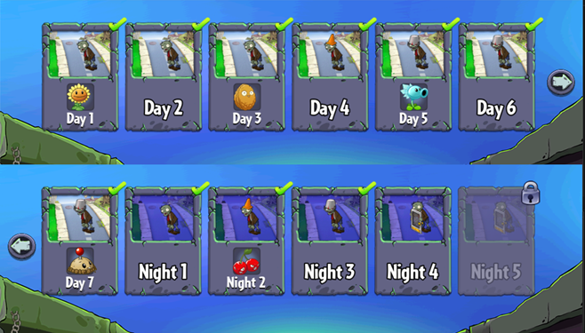

Tuy nhiên khi mới bắt đầu, bạn chỉ mở được 1 level. Chiến thắng lần lượt từng level để mở khóa và chơi level tiếp theo:

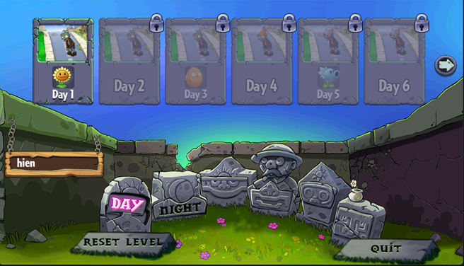

Ngoài ra còn có 3 nút chức năng khác để người chơi đổi tên, đóng game hay thậm chí là reset lại tiến trình của game để
trải nghiệm game lại từ đầu.

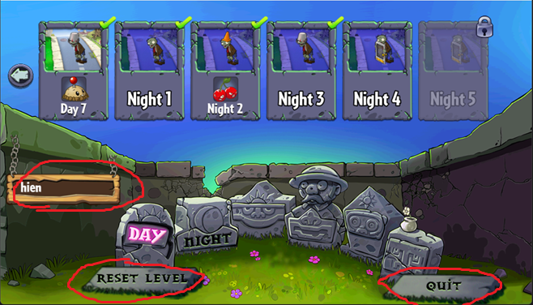

Khi vào game, có 2 loại level mà mọi người sẽ gặp: buổi sáng (bên trái) và buổi tối (bên phải)

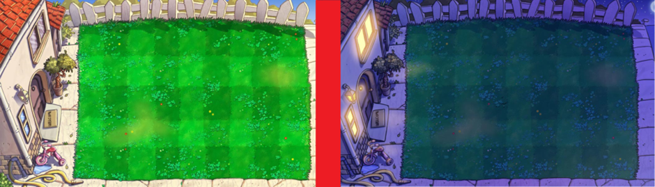

- Buổi sáng thì thi thoảng sẽ có sun (mặt trời) từ trên trời rơi xuống.
- Còn buổi tối thì không có, vậy nên game sẽ khó hơn một chút.

Trước khi bắt đầu game, bạn sẽ được biết trước có những loại zombie gì sẽ xuất hiện.

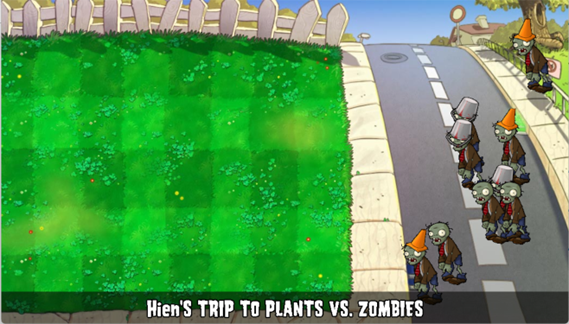

# 3. Các thành phần trong game:

-    Sun (Mặt trời) 
     : là đơn vị để mua plant (cây) trong game. Nhấp vào để thu. Và nên chú ý là nếu một sun tồn tại quá lâu, nó sẽ mờ
     dần rồi biến mất. Bạn sẽ không thể thu chúng sau khi chúng đã biến mất.

-    Sun bar (Thanh mặt trời) 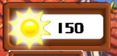
     : là bảng đếm số mặt trời mà người chơi đang có

- Plant seeds: tất cả các giống cây là người chơi đang sở hữu. Để chọn một giống cây mang đi trồng, người chơi phải
  click vào plant seed hoặc nhấn phím 1, 2, 3, 4, 5 (như trong game đánh dấu) để chọn cây rồi trồng trên sân. Tất nhiên,
  bạn phải đủ sun để mua cây và plant seed phải có thời gian chờ khác nhau để trồng cây giống đó lần nữa.

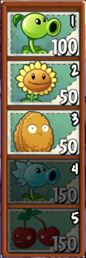

- Shovel (Xẻng): Là vật dụng vô cùng hữu hiệu để bạn có thể đào đi những cây không cần thiết và thay vào đó cây mới.

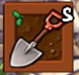

- Thanh tiến trình game (progress bar): Là thanh bạn có thể theo dõi để xem còn bao nhiêu zombie tiếp theo sẽ ra hay bạn
  đã chơi được bao nhiêu phần của level. Bên trái sẽ là level hiện tại bạn đang chơi.

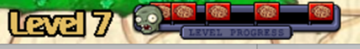

- Nút tua nhanh game (Turbo button): Nếu thấy game quá chậm hay quá dễ mà bạn cần tiết kiệm thời gian, hãy nhấn nút để
  trải nghiệm game với tốc độ x2 tốc độ gốc.
- Và nếu thấy game quá đáng sợ ở tốc độ này, hãy nhấn lại để game trở về tốc độ bình thường.
  ● Game ở tốc độ ban đầu:  

● Game đang ở tốc độ nhanh gấp 2 ban đầu:  

- Nút dừng game (Pause Button): Bạn có việc cần dừng game để lúc sau chơi tiếp ư? Hay bạn muốn điều chỉnh âm lượng của
  nhạc nền và hiệu ứng âm thanh? Quá đơn giản, game có thể dừng lại bằng cách click 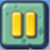  hoặc
  click đâu đó bên ngoài game.
- Máy cắt cỏ (Mower): Nếu bạn để zombie lại quá gần nhà, máy cắt cỏ sẽ tự động kích hoạt và tiêu diệt tất cả zombie hiện
  tại đang ở hàng đó. Chú ý là mỗi hàng chỉ có một máy cắt cỏ thôi.

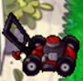

- Bố cục game cơ bản:

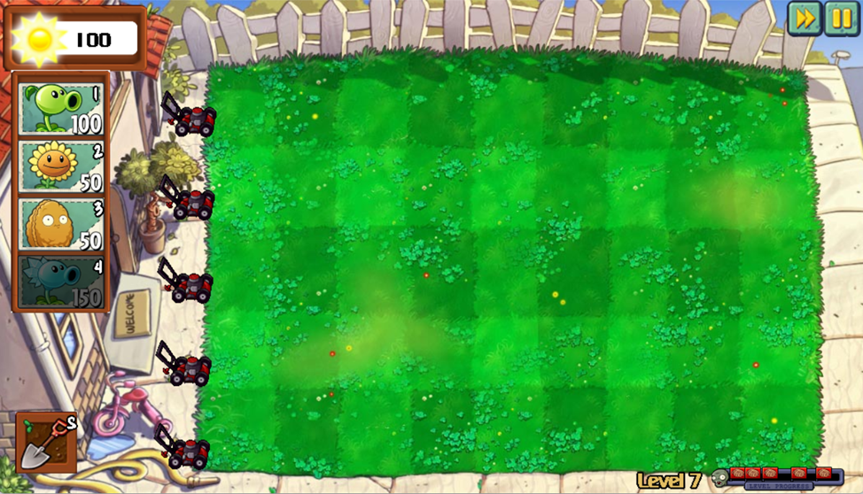

 

# 4. Cách chơi

Trồng cây để tấn công và phòng thủ, không cho zombie bước vào nhà bạn. 
Để trồng cây, Chọn hạt giống của cây đó (bàn phím hoặc click chuột) rồi đặt vào ô muốn trồng.  
Có thể đào những cây đang sử dụng bằng xẻng. 
Cây sẽ bị zombie ăn mất.

## a. Các loại cây

Có 6 loại cây, lần lượt theo thứ tự có thể nhận được trong game là:

|                                                                             | Tên cây	     | Chức năng                                                                                                                    |
|-----------------------------------------------------------------------------|--------------|------------------------------------------------------------------------------------------------------------------------------|
|   | Peashooter	  | Mỗi lần bắn một đậu vào zombie.                                                                                              |
| 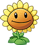    | Sunflower	   | Tạo thêm mặt trời để trồng cây                                                                                               |
| 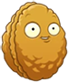          | Wall-nut	    | Chịu được nhiều phát ăn của zombie để bảo vệ các cây khác.                                                                   |
| 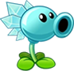        | Snow Pea	    | Mỗi lần bắn một đậu băng vào zombie. Đậu băng không tăng sát thương nhưng làm chậm tốc độ di chuyển và tốc độ ăn của zombie. |
| 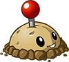 | Potato Mine  | Tiêu diệt zombie khi chạm nó nhưng cần thời gian để kích hoạt.                                                               |
| 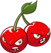  | Cherry Bomb	 | Ngay lập tức tiêu diệt tất cả zombie trong khu vực 3x3.                                                                      |

## b. Các loại zombie

- Có 5 loại zombie:

|                                         | Tên zombie 	       | Chức năng                                                                                        |
|-----------------------------------------|--------------------|--------------------------------------------------------------------------------------------------|
| 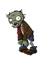 | Browncoat Zombie	  | Ăn cây và não của bạn.                                                                           |
| 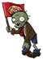   | Flag Zombie	       | Báo hiệu một lượng lớn zombie đang chuẩn bị ra.                                                  |
| 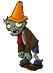   | Conehead Zombie	   | Trâu gấp 3 lần zombie thường                                                                     |
| 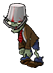 | Buckethead Zombie	 | Trâu gấp 6.5 lần zombie thường                                                                   |
| 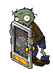   | Door Zombie	       | Trâu gấp 6.5 lần zombie thường. Không bị ảnh hưởng bởi sự làm chậm của đạn băng nếu vẫn còn cửa. |

# 5. Chiến thắng và thất bại

- Bạn sẽ chiến thắng nếu tiêu diệt hết tất cả zombie trong ván đó.

- Bạn sẽ thất bại nếu có một zombie nào đó đi hết sân để vào nhà bạn.

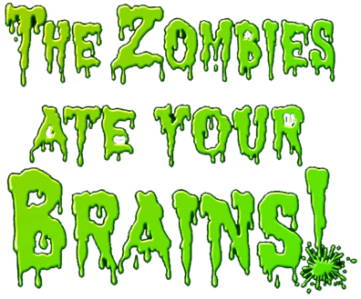

---

### Về đồ họa của game:

[[Cách làm hiệu ứng từng cây, zombie trong game]](about_graphics.md)

### Về source code game:

- Folder draw:
    * khởi tạo window và renderer
    * chứa tất cả các ảnh trong game (được đánh số)
    * chứa hầu hết các câu lệnh của SDL2, SDL2_image, SDL2_ttf, sử dụng để vẽ load ảnh, chữ và vẽ lên renderer, window.
- Folder elements: Chứa tất cả các thành phần của game:
    * bullets: các loại đạn
    * button: các loại nút trong game (có thể nhấn được hoặc không)
    * Map: chứa hàm random và khởi tạo bảng 5 x 9 cho màn chơi.
    * mower: máy cắt cỏ (Cán zombie)
    * plants: chứa tất cả các loại plant (được kế thừa từ class Plants)
    * zombies: chứa tất cả các loại zombies (được kế thừa từ class Zombie)
    * elements: gom lại các loại plants và zombies.
    * elements_actions:
        + chứa hầu hết các tương tác giữa các thành phần game với nhau, và với màn chơi.
        + tạo ngẫu nhiên zombie
        + cập nhật tất cả các thay đổi của game theo từng khung hình
- Folder events: Xử lý các sự kiện trong game (sự kiện chuột, bàn phím)
    * in_game: xử lý các sự kiện khi đang trong một màn chơi
        + credit: phần giới thiệu các loại zombie & ready-set-plant
        + game: tất cả các sự kiện trong một màn chơi
        + lose: xử lý khi thua
        + main_menu: xử lý khi người chơi muốn trở lại phần chọn màn chơi
        + pause_menu: xử lý khi người chơi dừng game (nút dừng hoặc click ra ngoài game)
        + restart_menu: xử lý khi người chơi muốn chơi lại màn chơi
        + turbo: xử lý nút tăng tốc game
        + volume: xử lý nút điều chỉnh âm lượng nhạc nền và hiệu ứng.
        + win: xử lý khi chiến thắng trò chơi.
    * mouse_cursor: xử lý con trỏ chuột
    * out_game: xử lý các sự kiện ngoài màn chơi
        + choose_level: xử lý chọn màn chơi
        + quit_menu: xử lý nút quit game: tắt game
        + reset_level: xử lý nút reset level: xóa tiến trình chơi
        + start_game: xử lý nút "Click to start" để bắt đầu vào game.
        + unlock_plant: xử lý mở khóa plant mới.
- Folder level: xử lý phần lấy dữ liệu ván chơi.
- Folder music: xử lý phần âm thanh của game - SDL2_mixer
- Folder player: xử lý phần dữ liệu người chơi. Bao gồm việc lấy và thay đổi tên, tiến trình.
- game_stats.hpp: chứa tất cả thông số game
- game.hpp và game.cpp: hàm main() của trò chơi.
